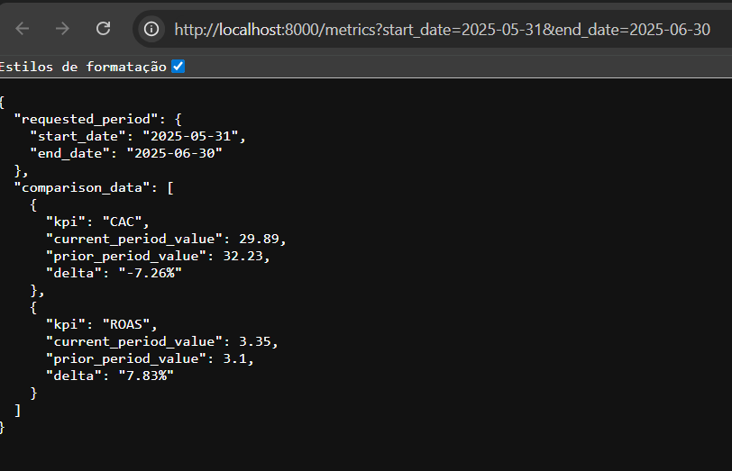

# AI Data Engineer - Dev Test Submission

This repository contains a complete, containerized solution for the AI Data Engineer technical assessment. The project demonstrates a full data pipeline, including automated data ingestion, SQL-based KPI modeling, and a RESTful API to make key business metrics accessible.

The entire application stack is defined and orchestrated using Docker Compose, ensuring a simple, one-command setup and perfect reproducibility.

## Architecture

The system is designed as a multi-container application where each service has a distinct responsibility.

```
[CSV File] -> [n8n Service] -> [PostgreSQL DB] <- [FastAPI API] <- [User/Client]
```

* **Data Ingestion (`n8n` Service):** An n8n container orchestrates the data pipeline. On startup, it automatically imports the workflow defined in the `/n8n` directory. The workflow reads the source CSV, adds provenance metadata, ensures the database schema exists, and inserts the data into the data warehouse.

* **Data Warehouse (`PostgreSQL` Service):** A dedicated PostgreSQL container serves as the data warehouse. It stores the raw advertising spend data and is made persistent across restarts using a named Docker volume.

* **Metrics API (`FastAPI` Service):** A lightweight Python API built with FastAPI serves the calculated KPIs. It queries the PostgreSQL database, performs the required calculations and comparisons, and exposes the results via a simple REST endpoint.

## Tech Stack

* **Containerization & Orchestration:** Docker, Docker Compose
* **API:** Python 3.9, FastAPI
* **Database:** PostgreSQL
* **Ingestion & Workflow Automation:** n8n

## How to Run the Project

This project is fully containerized. The only prerequisite is having Docker and Docker Compose installed.

### 1. Prerequisites
* [Docker](https://www.docker.com/products/docker-desktop/)

### 2. Clone the Repository
```bash
git clone <YOUR_REPOSITORY_URL>
cd <REPOSITORY_FOLDER>
```

### 3. Create the Environment File
This project uses a `.env` file to manage credentials, which are read by Docker Compose.
*(The default values are configured to work out-of-the-box.)*
This isn't a recommended approach by any means, but it works for the sake of simplicity of this project.

### 4. Build and Run the Services
Use Docker Compose to build the API image and start all three services (API, n8n, and Postgres).
```bash
docker compose up --build -d
```
The `-d` flag runs the containers in detached mode. You can view the logs at any time using `docker compose logs -f`.

### 5. Ingest the Data

1.  Navigate to the n8n UI in your browser: `http://localhost:5678`.
2.  Import the workflow from the n8n folder in this repo.
3.  You will need to configure the database credential for the two Postgres nodes the first time. Click on the credential dropdown, select "Create New", and enter the values from the `.env` file (Host: `db`, Database: `mydb`, User: `myuser`, etc.).
4.  Click **"Execute Workflow"** to run the ingestion process.

## Project Components

* `/api`: Contains the FastAPI application and its `Dockerfile`.
* `/n8n`: Contains the `workflow.json` for automatic import by the n8n service.
* `/models`: Contains the standalone SQL script for the KPI modeling.
* `/results`: Contains the screenshot of the final API output.
* `compose.yml`: Defines the entire multi-container environment and its services.
* `.env`: The required environment variables.

### Part 2 - KPI Modeling (SQL)
The SQL logic for the KPI modeling is encapsulated within the FastAPI service. For clarity and to explicitly meet the Part 2 deliverable, the standalone, commented query is also available at:
`models/kpi_analysis.sql`

This script can be run directly against the database using a client like pgAdmin to demonstrate the modeling logic in isolation.

### Part 3 - Analyst Access (API)
The API exposes a single endpoint to retrieve the required KPI analysis.

**Endpoint:** `GET /metrics`

**Query Parameters:**
* `start_date` (required): The start date of the analysis period (format: YYYY-MM-DD).
* `end_date` (required): The end date of the analysis period (format: YYYY-MM-DD).

**Example Request:**
The provided dataset contains data for the year 2025. To analyze the month of June 2025 vs. May 2025, use the following URL:
[`http://localhost:8000/metrics?start_date=2025-05-31&end_date=2025-06-30`](http://localhost:8000/metrics?start_date=2025-05-31&end_date=2025-06-30)

### Part 4 - Agent Demo (Bonus)
The API is designed to serve as a stable semantic layer for an AI agent. A natural language question like:
> “Compare CAC and ROAS for June vs May.”

would be handled as follows:
1.  **Entity Extraction:** An AI model would parse the query to extract key entities: **Metrics** (`CAC`, `ROAS`) and **Dates** (`start_date=2025-05-31`, `end_date=2025-06-30`).
2.  **API Call:** The agent would then make a programmatic call to the robust `/metrics` endpoint with these extracted dates.
3.  **Response Formulation:** The structured JSON response from the API would be used to synthesize a clear, natural-language answer for the user.

## Analysis Result
Below is a screenshot of the successful API response for the example request.

